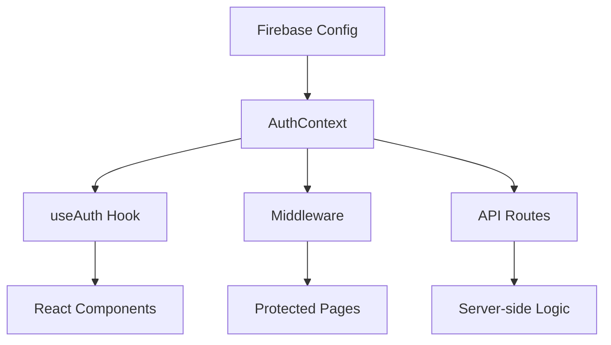

# Единая система аутентификации WorkInCZ

## Введение

Этот документ описывает новую унифицированную систему аутентификации для проекта WorkInCZ, которая объединяет все существующие подходы к аутентификации в единое решение. Система разработана для работы как с традиционными HTML/JS страницами, так и с современной Next.js частью приложения.

## Архитектура системы

### Компоненты системы

1. **Firebase Config** - единая конфигурация Firebase для всего приложения
2. **AuthContext** - React контекст для управления состоянием аутентификации
3. **useAuth Hook** - React хук для удобного использования аутентификации в компонентах
4. **Middleware** - промежуточное ПО для проверки аутентификации и прав доступа
5. **API Routes** - серверные эндпоинты для аутентификации

### Схема взаимодействия компонентов



## Основные возможности

### 1. Аутентификация

- Вход с email и паролем
- Вход через Google OAuth
- Регистрация новых пользователей
- Выход из системы
- Сброс пароля

### 2. Управление профилем

- Получение профиля пользователя
- Обновление профиля
- Хранение расширенной информации в Firestore

### 3. Управление ролями

- Поддержка множественных ролей: candidate, employer, agency, admin, vip, premium
- Переключение между ролями
- Проверка прав доступа на основе ролей

### 4. Безопасность

- Проверка токенов на стороне сервера
- Защита маршрутов на основе ролей
- Обработка ошибок аутентификации

## Использование в коде

### 1. В React компонентах (Next.js)

```tsx
'use client';

import { useAuth } from '@/hooks/useAuth';

export default function ProfilePage() {
  const { user, loading, error, updateUserProfile } = useAuth();
  
  if (loading) return <div>Загрузка...</div>;
  if (!user) return <div>Необходима авторизация</div>;
  
  const handleUpdateProfile = async (data) => {
    const result = await updateUserProfile(data);
    if (result.success) {
      // Обработка успешного обновления
    }
  };
  
  return (
    <div>
      <h1>Профиль пользователя</h1>
      <p>Имя: {user.displayName}</p>
      <p>Email: {user.email}</p>
      <p>Роль: {user.currentRole}</p>
      {/* Форма редактирования профиля */}
    </div>
  );
}
```

### 2. В API маршрутах

```tsx
// app/api/user/profile/route.ts
import { NextRequest, NextResponse } from 'next/server';
import { getAuth } from 'firebase-admin/auth';

export async function GET(req: NextRequest) {
  try {
    // Получаем ID пользователя из заголовка (установлен middleware)
    const userId = req.headers.get('x-user-id');
    if (!userId) {
      return NextResponse.json({ error: 'Unauthorized' }, { status: 401 });
    }
    
    // Получаем данные пользователя из Firebase Admin
    const userRecord = await getAuth().getUser(userId);
    
    // Возвращаем данные
    return NextResponse.json({ user: userRecord });
  } catch (error) {
    return NextResponse.json({ error: 'Internal Server Error' }, { status: 500 });
  }
}
```

### 3. Проверка ролей в компонентах

```tsx
'use client';

import { useAuth } from '@/hooks/useAuth';
import { redirect } from 'next/navigation';

export default function EmployerDashboard() {
  const { hasRole, loading } = useAuth();
  
  // Проверяем роль после загрузки
  if (!loading && !hasRole('employer')) {
    redirect('/dashboard');
    return null;
  }
  
  return (
    <div>
      <h1>Панель управления работодателя</h1>
      {/* Содержимое для работодателя */}
    </div>
  );
}
```

## Миграция со старой системы

### Шаги миграции для HTML/JS страниц

1. Подключите новые файлы конфигурации Firebase:

```html
<script src="/js/firebase-config.js"></script>
<script src="/js/firebase-integration.js"></script>
```

2. Используйте глобальные объекты для доступа к функциям аутентификации:

```javascript
// Старый код
firebase.auth().signInWithEmailAndPassword(email, password);

// Новый код
window.firebaseAuth.signInWithEmailAndPassword(email, password);
```

### Шаги миграции для Next.js компонентов

1. Замените прямые импорты Firebase на использование хука useAuth:

```tsx
// Старый код
import { auth } from '@/lib/firebase';
import { signInWithEmailAndPassword } from 'firebase/auth';

// Новый код
import { useAuth } from '@/hooks/useAuth';
const { signIn } = useAuth();
```

## Рекомендации по безопасности

1. **Всегда проверяйте аутентификацию на сервере** - не полагайтесь только на клиентскую проверку
2. **Используйте middleware для защиты маршрутов** - это обеспечивает единую точку проверки
3. **Храните чувствительные данные в Firestore с правильными правилами безопасности**
4. **Используйте Firebase Admin SDK для серверных операций**
5. **Регулярно обновляйте токены и проверяйте их валидность**

## Заключение

Новая унифицированная система аутентификации обеспечивает более надежный, безопасный и удобный способ работы с аутентификацией в проекте WorkInCZ. Она упрощает разработку, улучшает пользовательский опыт и обеспечивает плавный переход между различными частями приложения.

---

Документ создан: 31.07.2025  
Последнее обновление: 31.07.2025