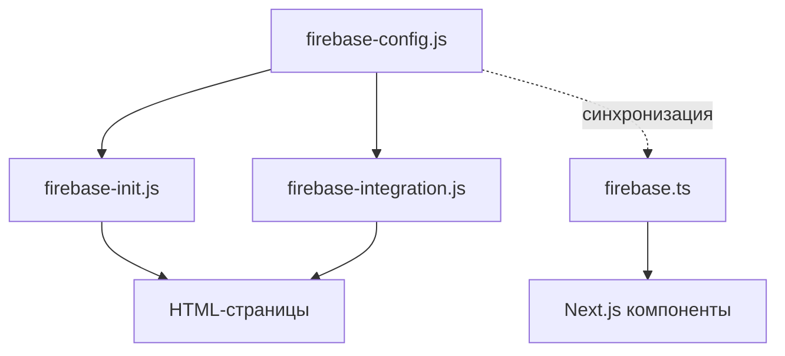

# Руководство по единой конфигурации Firebase для WorkInCZ

## Введение

В рамках стандартизации и улучшения архитектуры проекта WorkInCZ была внедрена единая система конфигурации Firebase. Этот документ объясняет структуру, принципы работы и правила использования этой системы.

## Проблемы, которые решает единая конфигурация

1. **Дублирование кода** - ранее конфигурация Firebase дублировалась в нескольких файлах
2. **Риски несинхронизированных настроек** - разные части приложения могли использовать разные параметры
3. **Сложность обновления** - при изменении параметров приходилось обновлять все места использования
4. **Отсутствие валидации** - не было централизованной проверки корректности конфигурации

## Архитектура решения

### 1. Структура файлов

```
public/js/
├── firebase-config.js       # Конфигурация Firebase для старых HTML-страниц
├── firebase-init.js         # Инициализация Firebase для старых HTML-страниц
└── firebase-integration.js  # Интеграция для совместимости со старым кодом

src/lib/
└── firebase.ts              # Конфигурация и инициализация для Next.js
```

### 2. Иерархия и зависимости



## Использование в коде

### 1. В старых HTML-страницах

Подключите следующие скрипты в указанном порядке:

```html
<!-- Firebase SDK -->
<script src="https://www.gstatic.com/firebasejs/10.7.1/firebase-app-compat.js"></script>
<script src="https://www.gstatic.com/firebasejs/10.7.1/firebase-auth-compat.js"></script>
<!-- Другие необходимые модули Firebase -->

<!-- Firebase Configuration & Integration -->
<script src="../js/firebase-config.js"></script>
<script src="../js/firebase-integration.js"></script>
```

Для страниц, требующих полной инициализации и всех возможностей:

```html
<script src="../js/firebase-config.js"></script>
<script src="../js/firebase-init.js"></script>
```

### 2. Использование в старом JavaScript

```js
// Получение конфигурации
const config = window.firebaseConfig;

// Доступ к сервисам
const auth = window.firebaseAuth || firebase.auth();
const db = window.firebaseFirestore || firebase.firestore();
```

### 3. Использование в Next.js (TypeScript)

```typescript
// Импорт всего модуля
import firebase from '@/lib/firebase';

// Использование
firebase.auth.signInWithEmailAndPassword(email, password);

// ИЛИ импорт отдельных сервисов/функций
import { auth, db, getCurrentUser } from '@/lib/firebase';

// Использование
auth.signInWithEmailAndPassword(email, password);
const user = getCurrentUser();
```

## Обновление конфигурации

При необходимости обновить параметры Firebase (например, при переходе на новый проект):

1. Обновите `src/lib/firebase.ts`, изменив значения переменных окружения или значения по умолчанию
2. Синхронизируйте изменения с `public/js/firebase-config.js`
3. Проверьте работу всех компонентов приложения

## Предпочтительный способ настройки

1. **Через переменные окружения** - используйте файлы `.env.local` или `.env.production` для хранения чувствительных данных
2. **По умолчанию** - значения по умолчанию используются только при отсутствии переменных окружения

## Валидация конфигурации

В обоих файлах (`firebase.ts` и `firebase-config.js`) реализована функция валидации конфигурации, которая проверяет наличие всех обязательных полей:

```js
function validateFirebaseConfig() {
  const requiredFields = [
    'apiKey', 'authDomain', 'projectId', 
    'storageBucket', 'messagingSenderId', 'appId'
  ];
  
  const missingFields = requiredFields.filter(field => !firebaseConfig[field]);
  
  return missingFields.length === 0;
}
```

## Безопасность

1. API-ключи Firebase защищены ограничениями на уровне Firebase Console
2. Правила безопасности настроены в Firebase для всех сервисов (Firestore, Storage, Realtime DB)
3. Для локальной разработки доступны эмуляторы Firebase (требуется раскомментировать соответствующий код)

## Миграция

При миграции существующего кода:

1. Не используйте инлайн-конфигурации Firebase - импортируйте из единого источника
2. Заменяйте прямые инициализации на использование глобальных сервисов
3. Следите за совместимостью версий Firebase SDK

## Поддержка и расширение

При добавлении новых сервисов Firebase:

1. Обновите `firebase.ts` и `firebase-init.js`, добавив новый сервис
2. Экспортируйте его для использования в других модулях
3. Обновите документацию

## Заключение

Единая система конфигурации Firebase значительно улучшает поддерживаемость, безопасность и расширяемость проекта WorkInCZ. Следуйте этому руководству при работе с Firebase в любой части приложения для обеспечения согласованности и надежности.

---

Документ создан: 31.07.2025  
Последнее обновление: 31.07.2025